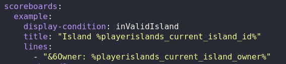

# PlayerIslands

This plugin allows players to create areas where they can do whatever you allow them to. This plugin is a lightweight solution for server owners who want their players to have a island/plot/cell without all of the overhead of a normal skyblock plugin. Area permissions are handled by WorldGuard for a more user-friendly system. Nearly every aspect of the plugin is highly customizable.

### Requirements
- There are a few required dependencies: [ServerUtils](https://www.spigotmc.org/resources/serverutils.106515/), [Vault](https://www.spigotmc.org/resources/vault.34315/), [WorldEdit](https://dev.bukkit.org/projects/worldedit) or [FAWE](https://www.spigotmc.org/resources/fastasyncworldedit.13932/), [WorldGuard](https://dev.bukkit.org/projects/worldguard)
- Optional dependencies: [PlaceholderAPI](https://www.spigotmc.org/resources/placeholderapi.6245/)
- You will also need a permissions plugin and I recommend [LuckPerms](https://luckperms.net/)

### Setup
- In the plugin's config.yml, there are two things you must change before the plugin can function
- You must define a world for the islands to generate in. It is advised to use a void world
- You must define a [template region](https://worldguard.enginehub.org/en/latest/regions/priorities/#template-regions) for all island regions to inherit from
  - Editing the template region will automatically push changes to all island regions
  


### Commands
- ```/island (/is)``` Player commands
  - Permission: ```playerislands.island```
- ```/islandadmin (/isadmin)``` Admin commands (permission required)
  - Permission: ```playerislands.islandadmin```

### Changing Commands
- Command syntax and description (what shows with help commands) can be changed in commands.yml, so you can change the wording to suit your use case.
- Editing the command to /cell instead of /island is quite annoying. Follow the following steps (every time you get a new jar file)
  - Open the PlayerIslands.jar file with WinRar or another archive manager
  - Open the plugin.yml folder and add any commands you want under the 'aliases:' section. Be sure to follow proper YAML formatting
  - Be sure to update the archive so the jar file can use the changes when it is run on the server
  - (optional) If you want to disable the main command 'island', you can do so using your server's commands.yml file (see [here](https://bukkit.fandom.com/wiki/Commands.yml))
- Example using /cell and /cellAdmin and disabling the /island command

 


### Command List and Permissions
- ```playerislands.islands.max.#``` Sets the maximum number of islands a player can create. (default of 1, max of 50)
- ```playerislands.islandadmin.privatebypass``` Bypass visiting an island if it is set to private
- **Player commands**
- ```/is create (playerislands.island.create)``` Creates a new island for this player
- ```/is help (playerislands.island.help)``` Opens the help menu for player commands
- ```/is home (playerislands.island.home)``` Teleports the player to their island home
- ```/is invite <player> (playerislands.island.invite)``` Sends the player an invitation to join your island
- ```/is join <player> (playerislands.island.join)``` Accept an invitation to another island
- ```/is leave (playerislands.island.leave)``` Leaves the island (only works for non-owners)
- ```/is menu [player] [include_member_islands] (playerislands.island.menu)``` Opens the island menu you are currently in (if no args provided). Otherwise, opens an island's menu (optional: include a player's member islands too)
- ```/is togglePrivacy (playerislands.island.togglePrivacy)``` Toggles the privacy of your island
- ```/is unInvite (playerislands.island.unInvite)``` Cancels an invitation you sent to another player
- ```/is visit <player> [include_member_islands] (playerislands.island.visit)``` Teleports the player to the specified player's island
- ```/is visitID <id> (playerislands.island.visitID)``` Teleports you to an island by its id
- ```/is visitRandom (playerislands.island.visitRandom)``` Teleports you to a random public island
- **Admin Commands**
- ```/isadmin addMember <owner> <player> [bypass_member_cap] (playerislands.islandadmin.addMember)``` Forcefully makes the player a member of the owner's island
- ```/isadmin help (playerislands.islandadmin.help)``` Opens the help menu for admin commands
- ```/isadmin menu [player] [include_member_islands] (playerislands.islandadmin.menu)``` Open an island's menu as an admin. Member editing is done through this command
- ```/isadmin pasteSchematic <upgradeLevel> (playerislands.islandadmin.pasteSchematic)``` Pastes an island schematic into the world like upgrading the island would do. This should only be used to validate schematics before using them with this plugin. Upgrade levels start from 0
- ```/isadmin reload [arg] (playerislands.islandadmin.reload)``` Reloads the plugin or a portion of it
- ```/isadmin resetIsland <id> (playerislands.islandadmin.resetIsland)``` Resets all of an island's upgrades to level 0
- ```/isadmin resetAllIslands <player> (playerislands.islandadmin.resetAllIslands)``` Resets all islands that this player owns
- ```/isadmin setIslandUpgrade <id> <upgradeType> <level> (playerislands.islandadmin.setIslandUpgrade)``` Set the upgrade level of an island (cannot reduce the size of an island)

### Island Menu
- The menu contains information about a player's island and is where they handle member management and upgrades


## Island Upgrades
- Currently, there are only two types of upgrades available. Upgrades cost money to purchase and only the owner of an island can purchase them
- Upgrades should not be removed from the config after players have purchased them
- Each upgrade can be given a cost and an optional permission that the player needs to purchase it
- **Size Upgrade**
  - Set the dimension of the island (dimension of its WorldGuard region)
  - Set the offset of the island spawn point (from the most negative corner)
  - Set the offset of the island region (starts from the most negative corner)
  - The schematic will be pasted depending on your location and orientation when you copy/save it with WorldEdit
- **Member Upgrade**
  - Set the maximum number of members an island can have

### Placeholders
- ```%playerislands_current_island_[arg]%``` Gets the island the player is in. Returns "null" if they are not in one
- ```%playerislands_island_[id]_[arg]%``` Gets the island its id. Returns "null" if none exists
- Placeholder arguments
  - ```owner``` Returns the name of the island owner
  - ```id``` Returns the id of the island
  - ```privacy``` "private" or "public" depending on the island's setting
  - ```privacyUppercase``` "Private" or "Public" depending on the island's setting
  - ```isMember``` "true" if the player is a member/owner of this island, "false" otherwise
  - ```isOwner``` "true" if the player is the owner of this island, "false" otherwise
- Example scoreboard for islands (see [TAB](https://github.com/NEZNAMY/TAB/wiki/Feature-guide:-Scoreboard))
  - For my example, I defined a [condition](https://github.com/NEZNAMY/TAB/wiki/Feature-guide:-Conditional-placeholders#condition-types) for my scoreboard
  



## Deleting Islands
- There is no way to delete an island. It is intended that the player will always have access to their island after making it
- To delete all island data, follow these steps
  - Stop your server
  - Delete the islands.db file
  - Delete all regions with the name island_(id) with WorldGuard
  - Start your server again. The islands.db file will regenerate and be empty